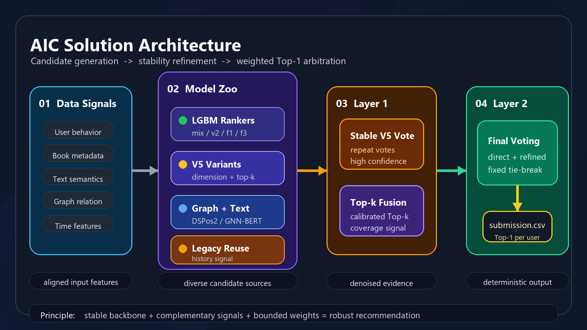
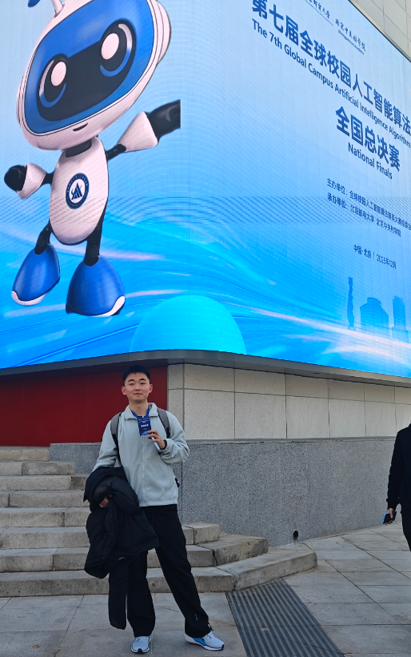
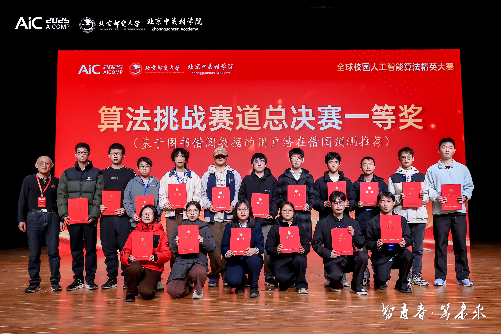

<h1 align="center">📚 AIC Solution</h1>

<p align="center">
  <b>Multi-Model Hierarchical Ensemble for Book Borrowing Recommendation</b><br>
  面向图书借阅预测的多模型分层融合推荐系统
</p>

<p align="center">
  
  
  
</p>

<p align="center">
  <a href="#-overview">Overview</a> ·
  <a href="#-architecture">Architecture</a> ·
  <a href="#-quick-start">Quick Start</a> ·
  <a href="#-model-zoo">Model Zoo</a> ·
  <a href="#-license">License</a>
</p>

---

## 📌 Project Background

我们是 Algorithm Challenge 图书借阅推荐赛 **初赛第一名** 的「噜啦啦」队，最终获 **国家一等奖**。比赛结束后，我们将最终提交方案与主要实现整理开源。

整理仓库时，我们没有把比赛过程中的痕迹都抹掉，部分目录结构、脚本命名和中间结果仍保留了当时迭代的状态。我们更想保留真实数据下有效的建模思路、融合方式和取舍过程，而不只是留下一个最终结果。希望这些内容能给后续参赛者和推荐系统学习者带来一点思路参考。


---

## 🧩 Architecture

<p align="center">
  
</p>

---

## ✨ Project Snapshot

| Part | What it carries | Output |
| --- | --- | --- |
| 🧠 Candidate Models | LightGBM / Graph / GNN-BERT 多路候选 | per-model CSV |
| 🔥 V5 Stable Vote | 跨参数仍然稳定的 user-book 对 | `stable_v5.csv` |
| 🎯 Top-k Fusion | 前排候选的覆盖信号 | `topk_ensemble.csv` |
| ⚖️ Final Ensemble | 权重投票与固定优先级仲裁 | `submission.csv` |

---

## ⚡ Quick Start

### 1. 📥 Clone

```bash
git clone https://github.com/Sihang-Geng/AIC_Solution.git
cd AIC_Solution
```

### 2. 🧪 Create Environment

```bash
conda create -n aic-solution python=3.10 -y
conda activate aic-solution
```

If conda has not been initialized:

```bash
conda init
conda activate aic-solution
```

### 3. 📦 Install Dependencies

```bash
pip install -r requirements.txt
```

<details>
<summary><b>Optional graph-model environment</b></summary>

For `dspos2` and `gnn_bert`, install PyTorch according to your CUDA version.

CUDA example:

```bash
pip install torch torchvision torchaudio --index-url https://download.pytorch.org/whl/cu121
pip install torch-geometric
```

CPU fallback:

```bash
pip install torch torchvision torchaudio
pip install torch-geometric
```

</details>

### 4. 🗂️ Prepare Artifacts

The ensemble scripts consume candidate CSV files generated by each model module.  
Normal candidate files use:

```csv
user_id,book_id
1,10001
2,10008
```

Top-k files additionally use:

```csv
user_id,book_id,score
1,10001,0.873
2,10008,0.742
```

具体文件路径在各脚本顶部集中配置，保持目录结构不变即可。

### 5. 🚀 Run

```bash
python ensemble_v5.py
python ensemble_topk.py
python final_ensemble.py
```

Expected outputs:

```text
stable_v5.csv
topk_ensemble.csv
submission.csv
```

---

## 📁 Repository Layout

```text
AIC_Solution/
|-- final_ensemble.py          # final weighted arbitration
|-- ensemble_v5.py             # V5 stable voting
|-- ensemble_topk.py           # Top-k auxiliary fusion
|-- requirements.txt
|-- assets/
|   `-- architecture.png
`-- models/
    |-- mix_lgbm/              # mixed LightGBM baseline
    |-- v5_ranker/             # V5 model family
    |-- f3_lgbm/               # feature auxiliary model
    |-- v2_lgbm/               # compact auxiliary model
    |-- f1_lgbm/               # coverage auxiliary model
    |-- dspos2/                # graph-based model
    |-- gnn_bert/              # graph + text representation
    `-- legacy_reuse/          # stable historical signals
```

---

## 🧠 Model Zoo

| Module | Style | Signal |
| --- | --- | --- |
| 🟢 `models/mix_lgbm` | LightGBM baseline | fast backbone |
| 🟣 `models/v5_ranker` | ranking family | stable variants |
| 🟢 `models/v2_lgbm` | lightweight GBDT | auxiliary candidate |
| 🟢 `models/f3_lgbm` | feature ranker | tabular supplement |
| 🟢 `models/f1_lgbm` | auxiliary ranker | coverage boost |
| 🔵 `models/dspos2` | graph model | structural signal |
| 🟣 `models/gnn_bert` | GNN + BERT | text and graph representation |
| 🟠 `models/legacy_reuse` | historical reuse | stable semi-final signal |

---

## 🔬 Technical Details

### 🧾 Feature Signals

- 👤 user-book interaction frequency
- ⏱️ borrowing interval and temporal behavior
- 📖 borrow duration and renewal pattern
- 🧾 book metadata and text representation
- 🔗 user-book graph neighborhood
- 🧠 BERT-style semantic embedding

### ⚖️ Fusion Signals

- 🎚️ Min-Max calibration for Top-k scores
- 🔥 vote thresholding for V5 variants
- ➕ weighted score accumulation
- 🧷 fixed-priority tie-breaking

---
## 📷 Competition Memories

代码之外，也想把这段经历留在这里。这几张照片是我对这次比赛的一点记录，有现场，也有和大家一起领奖的瞬间。

<table align="center">
  <tr>
    <td width="31%" align="center" valign="top"></td>
    <td width="31%" align="center" valign="top"></td>
    <td width="31%" align="center" valign="top"></td>
  </tr>
</table>

<p align="center">
  
</p>


---

## 📜 License

This project is released under the **GNU Affero General Public License v3.0 (AGPL-3.0)**. See [LICENSE](./LICENSE) for details.

---
